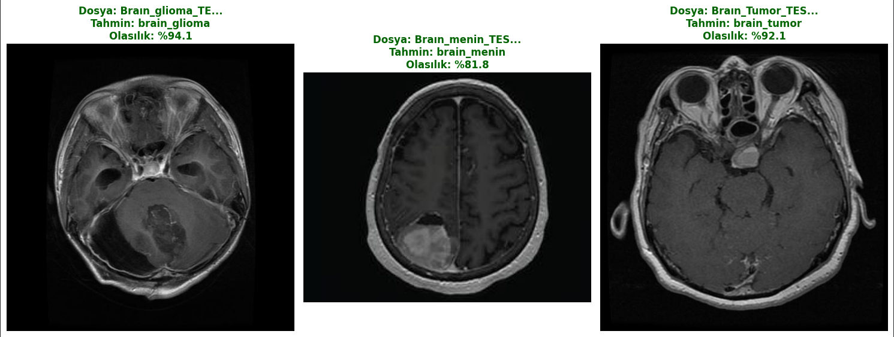

#  MR Görüntülerinin Derin Öğrenme ve Hibrit Mimarilerle Sınıflandırılması
<p align="left">
  <!-- 1. Satır -->
  
  
  
  
  <br>
  <!-- 2. Satır -->
  
  
  
  
</p>
<br>
##  Proje Hakkında
Bu çalışmada, beyin tümörü teşhisinde iş yükünü hafifletmek ve "ikinci bir görüş" asistanı sağlamak amacıyla; derin öğrenme, transfer öğrenme ve özgün mimariler kullanılarak yüksek hassasiyetli bir sınıflandırma sistemi geliştirilmiştir. 

Proje kapsamında geleneksel CNN modelleriyle yetinilmemiş; **Fine-tuning, Asymmetric Learning ve Feature Fusion** teknikleriyle 9 farklı hazır/hibrit modelin yanı sıra, baştan aşağı özgün olarak tasarlanan dikkat mekanizmalı **Custom ResAttNet** modeli geliştirilmiş ve karşılaştırılmıştır.

##  Amaç ve Sınıflar
Sisteme verilen MR görüntülerini analiz ederek hastayı yüksek doğrulukla aşağıdaki 3 sınıftan birine ayırmak:
* `brain_glioma`
* `brain_menin`
* `brain_tumor` 

##  Veri Seti ve Ön İşleme Mimarisi
Projede kullanılan veri seti, modelin gerçek öğrenme yerine ezberleme yapmasını önlemek amacıyla ciddi bir EDA sürecinden geçirilmiştir.
* **Boyutlandırma ve Bölütleme:** Görüntüler `224x224` boyutuna getirilmiş ve veri seti dengesini korumak için "Stratified Split" yöntemiyle %90 Eğitim/Doğrulama (5-Fold CV 50 Epoch) ve %10 Test olarak ayrılmıştır.
* **Veri Zenginleştirme (Augmentation):** MR görüntülerinde renk değişimi dokuyu bozabileceğinden, sadece geometrik dönüşümler (döndürme, çevirme vb.) kullanılmıştır.
* **Dinamik Veri Normalizasyonu:** Farklı mimariler (Inception, DenseNet vb.) farklı giriş aralıkları istediği için ön işleme (preprocessing) model dışında değil, **In-Model Preprocessing** (Rescaling katmanları) ile dinamik olarak çözülmüştür.

> ** Duplicate Data Temizliği:** EDA aşamasında `brain_tumor` sınıfında veri sızıntısına (data leakage) yol açabilecek 44 adet kopya (duplicate) görüntü tespit edilmiş ve özel bir algoritma ile silinmiştir.Böylece veri seti boyutu 6056'dan 6012'ye düşürülerek modelin özgün veriyle eğitilmesi garanti altına alınmıştır.

*Veri seti, GitHub 100MB boyut sınırına takılmaması için repoya dahil edilmemiştir. Projeyi çoğaltmak için veri setini indirip `DataSet/Brain_Cancer_Clean/` altına sınıflarına göre yerleştirmeniz gerekmektedir.
Zaten temiz olan dataseti kodun içerisinde yapabiliyoruz sırayla çalıştırdığınız durumda temiz dataset ile eğtim yapabilirsiniz.*

##  Eğitim Altyapısı (Donanım ve Optimizasyon)
Çok omurgalı (Multi-Backbone) devasa hibrit modellerin eğitimi standart donanımlarla günlerce sürebileceğinden, süreç tamamen donanım optimizasyonu odaklı yürütülmüştür:
* Eğitimler **Google Colab Pro** ortamında **NVIDIA A100 ve L4 GPU'lar** kullanılarak gerçekleştirilmiştir.
* Bellek verimliliği ve eğitim hızı için **Mixed Precision (float16)** politikası uygulanmıştır.
* Optimizer olarak **Adam/AdamW**; strateji olarak **WarmUp LR, Label Smoothing (0.08)** ve **Dropout / L2 Regülasyonu** uygulanarak modellerin "Cold Start" (soğuk başlangıç) dalgalanmaları ve ezberleme riskleri tamamen ortadan kaldırılmıştır.

##  Geliştirilen Mimariler ve Yaklaşımlar
Projeyi benzersiz kılan, mimarilerin tasarlanış felsefesidir. Toplamda 10 farklı model eğitilmiştir:

* Tekil Aktarımlı Öğrenme Modelleri: DenseNet121, InceptionV3, Xception, MobileNetV2.
* İkili Kombinasyonlar: Hybrid (DenseNet121 + EfficientNetB0)* modelinde EfficientNet kolu "sabit referans" (Frozen) olarak bırakılırken, DenseNet kolu eğitilmiş (Fine-Tuned) ve asimetrik bir yapı kurulmuştur.
* Triple Hybrid : DenseNet121 (Derinlik) + InceptionV3 (Genişlik) + Xception (Verimlilik) modellerinin eş zamanlı eğitildiği çok perspektifli mimari.
* Custom ResAttNet : Hazır ağırlık (Transfer Learning) kullanılmadan **sıfırdan (from scratch)** eğitilen; Residual (Artık) bağlantılar, **Squeeze-and-Excitation (SE) Dikkat Mekanizmaları** ve Swish aktivasyonu içeren özgün model.

##  Kapsamlı Karşılaştırma ve Sonuçlar
Tüm modeller "Kör Test" (Blind Test) ile internetten rastgele alınan dış görsellerle de test edilmiş ve klinik düzeyde güvenilirliklerini kanıtlamıştır.
<p align="center">
  
</p>
###  Performans Analizi Özeti
Karşılaştırma Tablosu.
<p align="center">
  
</p>

##  Detaylı Proje Raporu
Mimari felsefeleri, Confusion Matrix / ROC eğrisi analizleri ve matematiksel kanıtları detaylıca incelemek için projenin bilimsel raporuna göz atabilirsiniz:
 **[Brain_Tumor_Classification_Report.pdf](Result/Brain_Tumor_Classification_Report.pdf)**

##  Proje Klasör Yapısı
```text
BrainCancer-DeepLearning-Model/
├── DataSet/                                # Veri Seti 
├── Notebooks/
│   └── BrainCancer_Classification_Model_Comp.ipynb  # Ana Eğitim/Analiz Kodları
├── Result/
│   ├── Brain_Tumor_Classification_Report.pdf        # Kapsamlı Proje Raporu
│   ├── Best_Model_Result_Test.png                   # Best model kör test sonuçları
│   ├── RocCurve_ConfusionMatrix_Comparison/         # Görsel metrikler
│   ├── EDA/                                         # Veri seti keşif görselleri
│   └── models/                                      # Modellerin görselleri
├── TestData/                                        # Internetten alınan test görselleri
├── .gitignore
└── README.md
```

##  Geliştirici
**Abdullah Tunahan Karakuş**  
Computer Engineer 

##  Lisans
Bu proje **MIT License** kapsamında açık kaynak olarak paylaşılmıştır.
